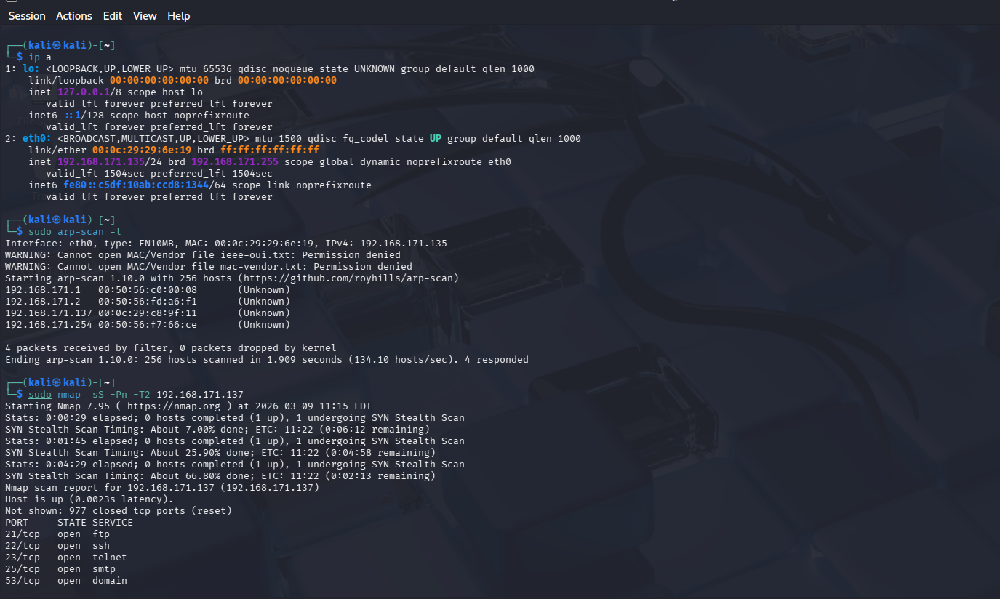
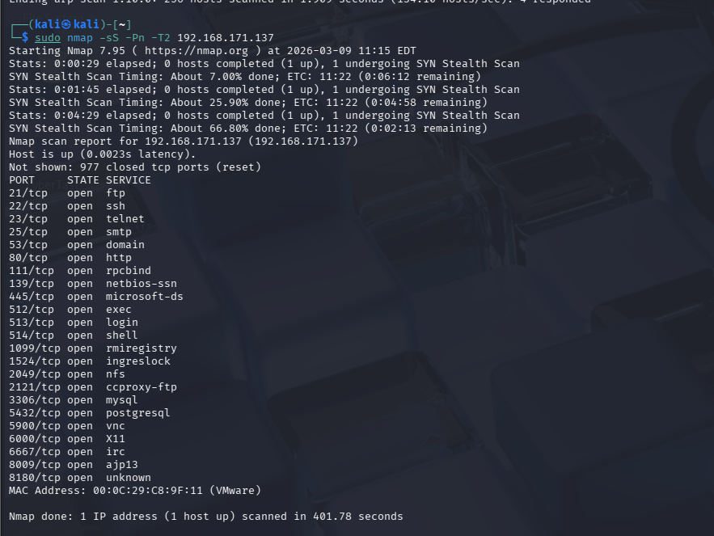
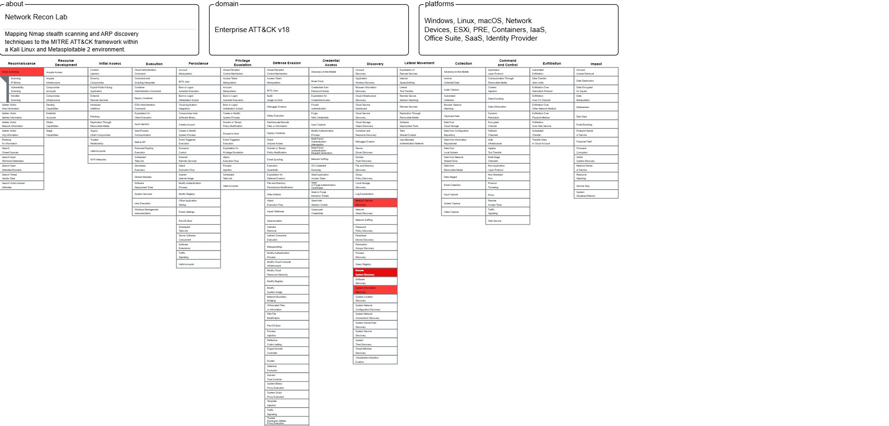

# My Hands-on Lab: From Network Scanning to MITRE Mapping 🛡️

This lab is a practical application of what I've learned about network enumeration. I wanted to move beyond just running commands and actually understand the strategy behind them using the MITRE ATT&CK framework.

## 🛠️ The Setup
I built a virtual environment using **Kali Linux** as my attack machine and **Metasploitable 2** as the target. My goal was to map the target's attack surface without being too "noisy" on the network.

## 🚀 Execution Steps
1. **Host Discovery:** I started with `arp-scan -l` to find active devices. I identified my target at `192.168.171.137`.
2. **Detailed Scanning:** I used a SYN Stealth Scan (`nmap -sS`) to identify services. I was surprised to find over 20 open ports, including old protocols like Telnet and FTP which are gold mines for attackers.

## 🎯 MITRE ATT&CK Alignment
To make this professional, I mapped my actions to the MITRE matrix:
* **T1018 (Remote System Discovery):** My initial ARP scan phase.
* **T1046 (Network Service Discovery):** The core Nmap phase where I enumerated the services.

> **What I learned:** Stealth matters. Running a full scan (`-A`) is easy, but learning to use `-sS` and timing flags (`-T2`) taught me how to stay under the radar in a real environment.

---
*Next up: Investigating the FTP service for potential exploits.*

---
## 📸 Lab Evidence

### Network Scanning Results

### MITRE ATT&CK Mapping

### Network Scanning Results
 
